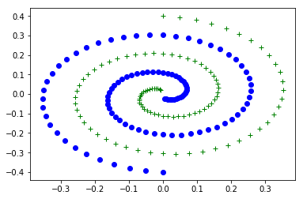
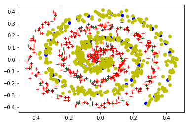
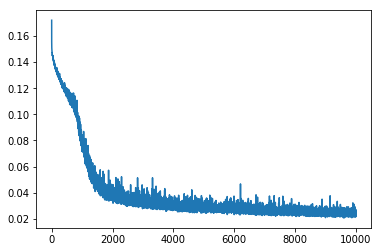
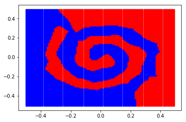

# 11040A   Neural Networks  Homework 3

## A Classification Problem : A Two-Nested-Spirals Problem

Name: XU Kuangzheng

Student ID: 44161528-6

## 2. Purpose: Separating the Two Classes Using Neural Network Classifier

### (1) Write a program to generate the training data set.


```python
import pandas as pd
import numpy as np
import matplotlib.pyplot as plt
%matplotlib inline
pi = 3.1415926535
from math import sin,cos

x_list_x = []
x_list_y = []
o_list_x = []
o_list_y = []

for i in range(1,100):

    alpha1=pi*(i-1)/25
    beta=0.4*((105-i)/104)

    x_list_x.append(beta*sin(alpha1))
    x_list_y.append(beta*cos(alpha1))

    o_list_x.append(-beta*sin(alpha1))
    o_list_y.append(-beta*cos(alpha1))

plt.plot(x_list_x,x_list_y, 'g+')
plt.plot(o_list_x,o_list_y, 'bo')
```





## Data Augmentation

To Avoid overfitting, I add 1000 instances as training data adding noise in **Normal Distrubution(Mean = 0, Standard Deviation = 0.02)**.


```python
import random

input_list = []
output_list = []

x_list_x_DA = []
x_list_y_DA = []

o_list_x_DA = []
o_list_y_DA = []

mean = 0
std_dev = 0.02

DA_num = 500

for idx in range(DA_num):
    elem = random.choice(x_list)
    dum_x = data['x'][elem]+np.random.normal(loc = mean,scale = std_dev)
    dum_y = data['y'][elem]+np.random.normal(loc = mean,scale = std_dev)

    x_list_x_DA.append(dum_x)
    x_list_y_DA.append(dum_y)

    input_list.append([dum_x,dum_y])
    output_list.append(0.1)

for idx in range(DA_num):
    elem = random.choice(o_list)
    dum_x = data['x'][elem]+np.random.normal(loc = mean,scale = std_dev)
    dum_y = data['y'][elem]+np.random.normal(loc = mean,scale = std_dev)
    o_list_x_DA.append(dum_x)
    o_list_y_DA.append(dum_y)
    input_list.append([dum_x,dum_y])
    output_list.append(0.9)

plt.plot(x_list_x,x_list_y, 'g+')
plt.plot(x_list_x_DA,x_list_y_DA, 'r+')
plt.plot(o_list_x,o_list_y, 'bo')
plt.plot(o_list_x_DA,o_list_y_DA, 'yo')


x_set = np.array(input_list)
y_set = np.array(output_list)
x_set1 = np.reshape(x_set, (len(x_set), 2))
```





## Handmade MLP

### (2) Design a neural network classifier.

I designed a *multilayer perceptron*(**MLP**) and initialied as follow.


```python
import math
import numpy as np

def tanh(x):
    return (1-math.exp(-2*x))/(1+math.exp(-2*x))

u = 0.05 # Learning Rate

h1 = 20
h2 = 10

W1 = np.random.random((2,h1))
W2 = np.random.random((h1,h2))
W3 = np.random.random((h2,1))
```

| Layer         		|     Description	        				   	|
|:---------------------:|:---------------------------------------------:|
| Input Layer      		| 2x1 x_coordinate and y_coordinate   			|
| Full Connected Layer  | 20 neurons with **tanh** as activation function |									
| Full Connected Layer  | 10 neurons with **tanh** as activation function |
| Output Layer      	| 1  neurons with **tanh** as activation function |

## Loss Function
### (3) Define a loss function.

I choose as **squared error** as loss function.


```python
def loss(p,y):
    return (p-y)*(p-y)/2
```

### (4) Have a summary of the Backpropagation (BP) algorithm.

Backpropagation is a method to calculate the gradient of the loss function with respect to the weights in an artificial neural network. It is commonly used as a part of algorithms that optimize the performance of the network by adjusting the weights, for example in the gradient descent algorithm. It is also called backward propagation of errors.

Often the term "backpropagation" is used to refer to the entire procedure of gradient calculation and its use in optimization. However backpropagation is merely the calculation of the gradient using elementary calculus, independent of the optimization algorithm.

The optimization algorithm repeats a two phase cycle, propagation and weight update. When an input vector is presented to the network, it is propagated forward through the network, layer by layer, until it reaches the output layer. The output of the network is then compared to the desired output, using a loss function, and an error value is calculated for each of the neurons in the output layer. The error values are then propagated backwards, starting from the output, until each neuron has an associated error value which roughly represents its contribution to the original output.

### (5) Write a program to implement the BP algorithm;
I merge my feedward part and backpropagation part as follow.


```python
error_list = []
def train(x_l, W1, W2, W3, y):
    """
    Feedforward Part

    W1 : Weights between Input Layer and Hidden Layer 1
    W2 : Weights between Hidden Layer 1 and Hidden Layer 2
    W3 : Weights between Hidden Layer 2 and Hidden Layer 3
    """

    x = np.reshape(x_l,(2,1))
    #print("x",x.shape)

    a = np.dot(W1.T,x)
    a_list = []
    da_list = []

    for elem in a:
        dum = tanh(elem)
        a_list.append(dum)
        da_list.append(1-dum**2)
    aaa = np.array(a_list)
    aa = np.reshape(aaa,(20,1))
    daa = np.array(da_list)
    da = np.reshape(daa,(20,1))

    #print("aa.shape:",aa.shape)

    b = np.dot(W2.T,aa)
    #print("b.shape",b.shape)
    b_list = []
    db_list = []
    for elem1 in b:
        dum1 = tanh(elem1)
        b_list.append(dum1)
        db_list.append(1-dum1**2)
    aba = np.array(b_list)
    ab = np.reshape(aba,(10,1))
    dba = np.array(db_list)
    db = np.reshape(dba,(10,1))
    #print("ab:",ab)

    c = np.dot(b.T,W3)
    p = tanh(c)

    error = loss(y,p)
    #print(error)
    error_list.append(error)

    """
    BackPropergation Part
    """
    derr = 1-p**2
    delta3 = -(y-p)*derr
    delta2 = (db*W3*delta3).T
    dW3 = (ab*delta3)
    #print("delta2",delta2.shape)
    #print("dW3",dW3.shape)
    delta1 = np.dot(W2,delta2.T)*da
    dW2 = np.dot(aa,delta2)
    #print("delta1",delta1.shape)
    #print("dW2",dW2.shape)
    delta0 = np.dot(W1,delta1)
    dW1 = np.dot(x,delta1.T)
    #print("delta0",delta0.shape)
    #print("dW1",dW1.shape)


    W3 = W3 - u*dW3
    W2 = W2 - u*dW2
    W1 = W1 - u*dW1

idx_list = []
for idx in range(len(x_set1)):
    idx_list.append(idx)

loop = 10000
for dum_idx in range(loop):
    random.shuffle(idx_list)
    for index in idx_list:
        train(x_set1[index], W1, W2, W3, y_set[index])
```

### (6) Train the neural network.
####  Discuss how you have tried to solve the local minimum problem and overfitting problem;

   I solve the *local minimum problem* by random initial weights by multi times. As to the *overfitting problem*, I use data augmentation and monitor the state of error of test set.

####  Show the error curves for training data.


```python
plt.plot(error_list)
```





### (7) After training the neural network, try to show in a figure how well the trained neural network can separate the two spirals. (generalization ability)

I define a feedfoward neural network to load the weights I trained before, and I predict the area x [-0.5,0.5] ,y [-0.5, 0.5] with stride 0.01.


```python
def feedfoward(x,W1,W2,W3):
    x = np.reshape(x_l,(2,1))
    #print("x",x.shape)

    a = np.dot(W1.T,x)
    a_list = []
    da_list = []

    for elem in a:
        dum = tanh(elem)
        a_list.append(dum)
        da_list.append(1-dum**2)
    aaa = np.array(a_list)
    aa = np.reshape(aaa,(20,1))
    daa = np.array(da_list)
    da = np.reshape(daa,(20,1))

    #print("aa.shape:",aa.shape)

    b = np.dot(W2.T,aa)
    #print("b.shape",b.shape)
    b_list = []
    db_list = []
    for elem1 in b:
        dum1 = tanh(elem1)
        b_list.append(dum1)
        db_list.append(1-dum1**2)
    aba = np.array(b_list)
    ab = np.reshape(aba,(10,1))
    dba = np.array(db_list)
    db = np.reshape(dba,(10,1))
    #print("ab:",ab)

    c = np.dot(b.T,W3)
    p = tanh(c)

    return p
```


```python
r_list_x = []
r_list_y = []
b_list_x = []
b_list_y = []

for idx_x in range(100):
    for idx_y in range(100):
        x = idx_x*0.01-0.5
        y = idx_y*0.01-0.5
        p = np.array([x,y])
        p1 = np.reshape(p, (1, 2))
        p1_pred = feedfoward(p1,W1,W2,W3)

        if p1_pred > 0.5:
            r_list_x.append(x)
            r_list_y.append(y)
        else:
            b_list_x.append(x)
            b_list_y.append(y)

plt.plot(r_list_x,r_list_y, 'r.')
plt.plot(b_list_x,b_list_y, 'b.')
```



